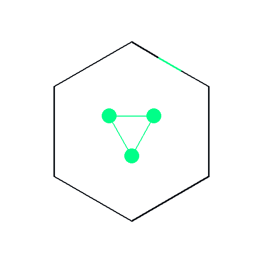

<p align="center">
  <a href="./README.md"></a>
  <a href="./README.zh.md"></a>
</p>

<br/>

<pre>
 __  _  ___  ____   __   _ _____ ____ ___   ____  _  _ _____ _____
|  \| ||_  || |    / |  / \_   _| |  |   |_/  || ||_   _|  _  /  |
| ' \ | |_|| |    /  /  / -_\ | | |  |  |  ___ | | |   _| |  |  |
|-__|| ___||_|__/_ /_  \___\|_| |__||__|  /__/|_| |   |_| __| __|
                                                                  
</pre>

<pre>
╔══════════════════════════════════════════════════════════════╗
║  I N D U S F U Z Z  ·  Industrial Protocol Fuzzing Agent      ║
╚══════════════════════════════════════════════════════════════╝
</pre>

<p align="center">
  
</p>

---
## 1. Introduction

**IndusFuzz** is an industrial protocol fuzzing agent. It drives protocol-level fuzzing with a local LLM and automatically falls back to local deterministic random mutation when the LLM is unavailable.

- LLM-driven mutation with automatic fallback to local deterministic random mutation
- Local-first: the model runs locally, so payloads never leave your machine
- Interactive command-line wizard, no coding required to run

Supported protocols: **Modbus TCP, S7Comm, DNP3, IEC 60870-5-104, IEC 61850 MMS, EtherNet/IP, OPC UA**; more are expected.

> Security notice: Only use this against systems you are explicitly authorized to test. This tool may cause production equipment to fail.

---

## 2. Background & Design

### 2.1 Why fuzz industrial protocols

Industrial control system (ICS) protocols (e.g., Modbus, S7Comm, IEC 61850) were designed for functionality and real-time performance, with little regard for security. This has produced many real-world vulnerabilities:

- **CVE-2026-44107** — an unauthenticated attacker can trigger a charging-controller restart over Modbus TCP, causing a denial of service.
- **CVE-2026-4436** — a low-privileged remote attacker can manipulate register values via Modbus frames to over- or under-dose the odorant in a natural-gas pipeline.
- **Delta Electronics DVP12SE PLC** — the Modbus TCP service has no authentication or access control, allowing unauthorized interaction.
- **OpenPLC_v3** — a heap-buffer-overflow exists in the Modbus host-side code.

### 2.2 Pain points of traditional fuzzing

- Relies on expert experience and is time-consuming
- Incomplete coverage and hard to adapt to private/proprietary protocols
- Manual response analysis and anomaly judgment are inefficient
- Cannot quickly generate a diverse set of test cases

### 2.3 Design evolution

The original PRD envisioned a full multi-agent framework (seed generation / test-case generation / feedback analysis + AgentScope + RAG + Flask web UI). During implementation we converged the architecture to **LLM-driven mutation with a local deterministic fallback**: the LLM produces semantic mutations, and when it is unavailable the tool automatically falls back to local deterministic random mutation. This path has been validated — see the academic MALF framework (multi-agent LLM fuzzing, Qwen2.5-14B, 88–92% test-case pass rate on Modbus/TCP) as a reference.

### 2.4 Privacy and local-first commitment

By default everything runs on local Ollama, so data never leaves your machine. Cloud-API requests are sent to a third party; do not use them in privacy-sensitive environments.

### 2.5 Success criteria

- **Minimum viable** — automatically generate and send mutated Modbus cases and detect anomalous responses.
- **Qualified** — local LLM mutation + anomaly detection + reproducible test reports.
- **Excellent** — support multiple industrial protocols and become a trusted security tool for high-risk industrial devices.

---

## 3. Roadmap

| Version | Major changes | Status |
|---------|---------------|--------|
| v1.8.5 | Timeout race fix, granular impact descriptions, LLM model info in report, README restructure, README sync enforcement (version/P3a/P3c mandatory every release), daemon thread socket shutdown fix | Current | (147 pytest cases, Windows runner, pre-commit), version fallback consistency fix, flat directory migration, black 24.10.0 formatting, mcp dependency, auto CHANGELOG Release body | Current |
| v2.0.0 | Cross-platform (macOS/Linux), desktop app, NVD/CNVD comparison | Future |

---

## 4. Environment Requirements

| Item | Requirement |
|------|-------------|
| Python | 3.10 or later (64-bit) |
| OS | Windows 10 / 11 (64-bit) |
| Disk | ~1 GB for code and dependencies; pulling local models requires additional space |
| GPU (optional) | NVIDIA GPU + CUDA, only to accelerate local Ollama inference |

No GPU is required. Ollama runs on CPU by default; when using local Ollama, the wizard asks whether to enable GPU acceleration.

---

## 5. System Compatibility

| Feature | Windows 10/11 | macOS | Linux |
|---------|--------------|-------|-------|
| Main flow (fuzzing) | ✅ Tested | ⚠️ Untested | ⚠️ Untested |
| API key encryption | ✅ DPAPI | ❌ Not supported | ❌ Not supported |
| S7Comm | ✅ | ⚠️ libsnap7 needed | ⚠️ libsnap7 needed |
| Auto-open report | ✅ | ⚠️ Unknown | ⚠️ Unknown |
| Default ports 102/502 | ⚠️ Admin required | ⚠️ Needs sudo | ⚠️ Needs sudo |

**Official support:** Windows 10/11 (64-bit) only.

**Untested:** macOS and Linux. Theoretically feasible, but the following issues may occur:
- API key encryption is unavailable (DPAPI is Windows-only); use the "No LLM" mode instead.
- Some ports require administrator privileges.
- Auto-opening reports / directories may fail.

---

## 6. Installation

### Source installation (recommended for developers)

#### Installation by platform

**Windows users** (recommended, tested):
Follow the steps below.

**macOS users** (untested):
1. Install Python 3.10+.
2. Install Homebrew.
3. `brew install snap7` (required for S7Comm).
4. `pip install -r requirements.txt`.
5. Known issue: API key encryption is unavailable; use "No LLM" or a local LLM.

**Linux users** (untested):
1. Install Python 3.10+.
2. `sudo apt install libsnap7-dev` (required for S7Comm).
3. `pip install -r requirements.txt`.
4. Known issues: ports 102/502 require sudo; API key encryption is unavailable.

#### Virtual environment

A virtual environment isolates dependencies so they do not affect your system Python.

- `python -m venv agentscope_env` creates an isolated `agentscope_env/` directory with its own Python and pip.
- After activation, the terminal prompt becomes `(agentscope_env) PS C:\...>`.
- Exit the virtual environment with `deactivate`.
- Delete it by removing the `agentscope_env` directory.
- A virtual environment is preferred over system Python: per-project isolated installs, no version conflicts, and only one directory to delete.

```bash
# 1. Clone the repository
git clone https://github.com/TaoYaTou/IndusFuzz.git
cd IndusFuzz

# 2. Create and activate a virtual environment
python -m venv agentscope_env
.\agentscope_env\Scripts\activate

# 3. Install dependencies
pip install -r requirements.txt

# 4. Configure model source (see the next section)
python main.py
```

> On Windows use `.\agentscope_env\Scripts\activate` (PowerShell: `.ps1`, cmd: `.bat`). If you are a collaborator, replace the git URL with your fork.

### EXE installation (recommended for end users)

**Available from Releases.** Download `IndusFuzz.exe` or the ZIP from the GitHub [Releases](../../releases) page. The **ZIP is recommended**, because it contains all required files.

### Verify the installation

```bash
python main.py
```

The IndusFuzz banner and interactive wizard appearing means success. Press `q` to exit when prompted.

---

## 7. Quick Start

1. **Start**: `python main.py` or `start_fuzz.bat` or `IndusFuzz.exe`
2. **Follow the wizard**: choose model source, scenario, protocols, function codes, targets, timeout.
3. **After the run**, open the reports in the `reports/` directory.

---

## 8. Supported Protocols

| Protocol | Default Port | Typical Devices | Built-in Mock Slave | Simulator Tested |
|----------|--------------|-----------------|---------------------|------------------|
| Modbus TCP | 5020 | PLC, RTU, VFD | Yes | ✅ (full response) |
| S7Comm | 10102 | Siemens S7 PLC | Yes | ✅ (COTP Setup + S7 Setup + DATA phases) |
| DNP3 | 20000 | RTU, IED (power) | Yes | — |
| IEC 60870-5-104 | 2404 | Substation SCADA telecontrol | Yes | — |
| IEC 61850 MMS | 102 | Substation IED, bay controller | Yes | ✅ (COTP Setup + MMS Initiate + READ phases) |
| EtherNet/IP | 44818 | Rockwell / Allen-Bradley controllers | Yes | — |
| OPC UA | 4840 | Industrial gateway, HMI, server | Yes | — |

More protocols are expected to be added in the future.

Typical use cases:

- **Modbus TCP** — the most common industrial transport protocol; prioritize PLC, RTU, VFD testing first.
- **S7Comm** — Siemens SIMATIC S7 controllers; a proprietary protocol over ISO/COTP.
- **DNP3** — RTUs and IEDs in power-industry SCADA.
- **IEC 60870-5-104** — TCP telecontrol for grid dispatch / SCADA.
- **IEC 61850 MMS** — IED communication in digital substations based on MMS/ASN.1.
- **EtherNet/IP / CIP** — Rockwell control systems and common industrial Ethernet devices.
- **OPC UA** — the interoperability layer between gateways, HMIs, historians and field servers.

---

## 9. Usage Scenarios

### Scenario 1: Local self-test

- Choose scenario **local self-test**. The built-in mock slave auto-starts in **strict** mode.
- At the confirmation step press `L` to switch between strict/loose modes, then view the report after the run.

### Scenario 2: LAN testing (LAN devices)

- Specify a LAN device as the target by `IP:port`.
- Make sure you have obtained testing authorization.

### Scenario 3: Real devices

- Requires explicit testing authorization. It is recommended to validate the tool in a local self-test environment before touching production devices.

---

## 10. Real Device Testing Guide

### 14.1 Prerequisites

Before running fuzzing against real industrial devices, ALL of the following must be satisfied:

- [ ] Written authorization from the device owner
- [ ] Physical isolation between the test network and the production network
- [ ] Emergency stop plan in place (power cut, E-stop button, network disconnect)
- [ ] The test target is NOT a Safety Instrumented System (SIS)
- [ ] The test time window has been approved by the operations team

**Platform requirement:** Real device testing is currently verified on Windows 10/11 only. macOS/Linux users connecting to real devices may encounter handshake failures for some protocols due to system library differences (e.g. libsnap7 version).

> ⚠️ Fuzzing sends malformed packets to devices, which may cause device crashes, production downtime, or even safety incidents. Never use the `lan` / `production` scenarios without satisfying all conditions above.

### 14.2 Connection Parameters by Protocol

| Protocol | Required Parameters | Defaults | Notes |
|----------|--------------------|----------|-------|
| Modbus TCP | Device IP, Port, Unit ID | 502 / 1 | Unit ID range 1-255, some devices use 255 |
| S7Comm | Device IP, Port, Rack, Slot | 102 / 0 / 1 | S7-300/400 usually use Slot 2 or 3, S7-1200/1500 use 1 |
| DNP3 | Device IP, Port, Master/Outstation Address | 20000 / 1 / 10 | Addresses must match device configuration |
| IEC 60870-5-104 | Device IP, Port, Common Address | 2404 / 1 | Common Address must match the device |
| IEC 61850 MMS | Device IP, Port, IED Reference | 102 / (auto-discovery) | IED reference is optional |
| EtherNet/IP | Device IP, Port, CPU Slot | 44818 / 0 | Slot defaults to 0 |
| OPC UA | Endpoint URL, Security Policy | 4840 / None | Endpoint format `opc.tcp://IP:port` |

### 14.3 Device Compatibility

| Protocol | Supported Devices | Special Requirements |
|----------|-------------------|----------------------|
| Modbus TCP | Generic PLC / RTU / Gateway | Some devices require Unit ID 255 |
| S7Comm | Siemens S7-300/400/1200/1500 | S7-1200/1500 need PUT/GET enabled in TIA Portal |
| DNP3 | Power RTU / IED | Master/slave addresses must match device config |
| IEC 104 | Substation RTU / SCADA master | Common Address must match the device |
| IEC 61850 | Digital substation IED (protection/control) | IED reference or auto-discovery |
| EtherNet/IP | Rockwell Logix / Schneider Modicon | Slot defaults to 0 |
| OPC UA | Industrial gateway / OPC UA server | Endpoint URL must be complete |

### 14.4 Connection Failure Troubleshooting

| Error | Cause | Fix |
|-------|-------|-----|
| Connection refused | Port not open or wrong IP | Check device IP and port |
| Timeout | Network unreachable or device not responding | Check network connection, try `ping` |
| Authentication failed | Insufficient permissions | For S7-1200/1500 check PUT/GET settings |
| Handshake failed | Handshake parameters mismatch | Check Rack / Slot / Address parameters |

### 14.5 Recommended Test Workflow

1. **Connectivity verification**: Use simple read/write packets to confirm the device is reachable and parameters are correct
2. **Low-frequency fuzzing**: Send a small number of packets (5-10) and observe device response
3. **Monitor device logs**: Confirm no anomalies, crashes, or alarms
4. **Gradually increase intensity**: Increase packet count and mutation level only after confirming safety

### 14.6 Production Environment Notes

- **Never** test while the production line is running
- Inform device operations staff of the test time window in advance
- Prepare device restart and recovery plans
- Continuously monitor device status during testing
- Immediately stop testing and disconnect the network if any anomaly occurs

---

## 11. Model Configuration

Only one model source is configured per run (applies globally to all protocols). There are 4 options:

| Option | Use case |
|--------|----------|
| Local Ollama | Recommended. Free and private, model runs locally. GPU can be enabled. |
| Cloud API | DeepSeek / OpenAI / custom cloud. Requires an API key. |
| Custom local model | OpenAI-compatible endpoint of vLLM / LM Studio / LocalAI on LAN. |
| No LLM | Local mutation only. Fully offline, no model needed. |

### Option 1: Local Ollama (recommended)

1. Install and run Ollama.
2. Pull a model, for example:
   ```bash
   ollama pull qwen2.5-coder:14b
   ollama serve
   ```
3. In the wizard choose **Local Ollama**; downloaded models are listed automatically.
4. GPU: when using Ollama, the wizard asks whether to enable GPU acceleration and enables it automatically if a compatible GPU is detected.

### Option 2: Cloud API (DeepSeek / OpenAI)

1. Obtain an API key from your provider.
2. In the wizard choose **Cloud API**, pick a preset (DeepSeek / OpenAI) or a custom endpoint.
3. Enter the API key and Base URL.
4. The API key is stored locally after encryption using Windows DPAPI.
**Cloud API requests are sent to a third party; do not use it in privacy-sensitive environments.**
### Option 3: Custom local model (vLLM / LM Studio / LocalAI)

1. Requires a local service exposing an OpenAI-compatible REST API.
2. In the wizard choose **Custom local model**.
3. Enter the Base URL of the local service, e.g. `http://localhost:1234/v1`.

### Option 4: No LLM

Choose **No LLM** to use local deterministic random mutation directly. No API key or model needed, fully offline.

---

## 12. Supported Models

### Models supported by local Ollama (recommended)

- `qwen2.5-coder:14b` (recommended)
- `qwen2.5-coder:7b` (lightweight)
- `deepseek-coder:6.7b`
- `llama3.1:8b`
- Any other official Ollama model

### Cloud API providers

- DeepSeek (`deepseek-chat`, `deepseek-coder`)
- OpenAI (`gpt-4o`, `gpt-4o-mini`)
- Other OpenAI-compatible endpoints (custom Base URL required)

### Frameworks supported as custom local models

- vLLM
- LM Studio
- LocalAI
- Other OpenAI-compatible services

---

## 13. Dependencies

| Package | Version | Purpose |
|---------|---------|---------|
| openai | 3.13.0 | LLM API calls |
| scapy | 2.7.0 | Packet construction / capture |
| pywin32 | 311 | Windows DPAPI encryption |
| pymodbus | 3.15.0 | Modbus protocol |
| reportlab | 5.0.1 | PDF generation |
| asyncua | 2.0.1 | OPC UA protocol |
| python-snap7 | 3.1.2 | S7Comm protocol |
| xhtml2pdf | 0.2.19 | HTML to PDF |

---

## 14. Reports

Reports are saved in the `reports/` directory:

| File | Use |
|------|-----|
| `report_<timestamp>.html` | Open in a browser |
| `report_<timestamp>.pdf` | Print or share |
| `run.log` | Raw run log |

Reports contain: statistical summary, risk grading, anomaly distribution, function-code statistics. When a protocol's fuzzing is force-terminated due to the overall timeout, a corresponding notice banner is shown at the top of the report.

---

## 15. Known Limitations

| ID | Protocol | Note |
|----|----------|------|
| P2-006 | OPC UA | The OPC UA implementation uses a **custom frame format** and may not be compatible with standard servers. |
| P2-011 | S7Comm | The S7Comm mock slave uses a **custom frame format** (non-standard port). |
| P2-016 | All (6 servers) | Servers assume a single `recv` returns a complete frame; TCP fragmentation/coalescing is not handled. |
| P2-017 | MCP integration | The 3 MCP integrations (`codeinspectus_mcp`, `codeguard_mcp`, `vulnclaw_mcp`) are still stubs, under development. |
| R5-7 | Error report | `_summarize_suggestions` and `generate_error_report` are currently only called by test scripts; main-flow integration is pending v1.8.3. |

---

## 16. Project Structure

```
IndusFuzz/
├── main.py                      # Entry: banner, environment check, wizard, start slave, fuzzing
├── requirements.txt             # Python dependencies
├── start_fuzz.bat               # One-click launch script
├── CHANGELOG.md                 # Release history (bilingual)
├── IndusFuzz.spec               # PyInstaller spec for EXE packaging
├── version_info.txt             # Version metadata for the packaged EXE
├── verify_build.py              # Build verification script
├── build.bat                    # Packaging script
├── 一键打包.bat                  # Windows one-click packaging entry
├── make_release.bat             # Release package assembly script
├── 清除缓存.bat                  # Packaging cache cleanup
├── run_all_tests.py             # 6-stage test orchestrator (with Chinese HTML report)
├── run_tests.bat                # One-click test entry
├── pytest.ini                   # pytest configuration
├── requirements-test.txt        # Test dependencies (pytest-cov / bandit / flake8 / black)
├── bandit_config.yml            # Bandit security scan configuration
├── .pre-commit-config.yaml      # pre-commit hooks (black 24.10.0 + flake8 + bandit)
├── .github/workflows/           # CI/CD (test.yml: push/PR → pytest+lint+bandit; release.yml: tag v* → PyInstaller→ZIP→GitHub Release with auto notes)
├── assets/
│   ├── fonts/simhei.ttf         # Chinese font for PDF rendering
│   └── concept_a_hex/           # App logo icons
├── src/
│   ├── core/version.py          # Single source of truth for version (git describe → env → HARDCODED three-source)
│   ├── core/*.py                # menu / fuzz_loop_llm / report_generator / security + 7 more
│   ├── protocols/               # 7 protocols (modbus/s7comm/dnp3/iec104/iec61850/enip/opcua) + registry + base + llm_mutator_base + func_codes/*.json
│   └── integrations/            # MCP integrations (codeguard / codeinspectus / vulnclaw)
├── config/                      # connect_templates.yaml
├── server/                      # 7 protocol mock slaves (*_server.py, supports --host --port --strict)
├── tools/
│   ├── verify/                  # 8 verification scripts
│   ├── legacy/                  # 2 legacy helpers
│   ├── check_protocol.py        # Protocol integrity self-check
│   └── clean_before_release.py  # Pre-release cleanup
├── tests/                       # conftest + helpers + 4 test_*.py (147 pytest cases)
├── docs/                        # PRD documents
└── reports/                     # Generated reports
```

---

## 17. FAQ

**The server connection failed, what should I do?**
Check whether the target `IP:port` is reachable, whether the port is occupied (e.g. `netstat -ano | findstr port`), and whether the environment and dependencies are installed. The wizard shows troubleshooting hints on failure.

**Ollama is not installed / I do not want to use a cloud model, how do I configure it?**
Choose **No LLM** at the model step. IndusFuzz falls back to local deterministic mutation when no model is configured.

**What is the difference between a custom local model and a cloud API?**
A custom local model points to an OpenAI-compatible service on your machine/LAN (`http://localhost:1234/v1`); data does not leave the machine. A cloud API sends requests to a third party; do not use it in sensitive scenarios.

**Why is the report full of NORMAL results?**
When the mock slave is in **loose** mode (always returns a fixed response) or the target does not respond to malformed frames, a high NORMAL ratio is normal. In **strict** mode the slave validates frames and returns exceptions or drops connections for invalid frames.

**The port is occupied, how do I handle it?**
Change the port, or free the occupied port. In local mode, the wizard can auto-assign an available port if the default one is busy.

**Which model should I choose?**
For local self-test, local Ollama is recommended (privacy, offline). Use a cloud API only when you need stronger LLM capability and accept offloading payloads.

**Can I use it on macOS/Linux?**
v1.8.3 officially supports Windows 10/11 only. macOS/Linux are theoretically possible but not fully tested; the following issues may exist:
- API key encryption is unavailable
- some ports require administrator privileges
- auto-opening reports may fail
Use it on Windows, or wait for the v2.0 cross-platform version.

**Why is it Windows-only?**
Because v1.8.3 uses the Windows-specific DPAPI to encrypt the API key. v2.0 plans to replace it with the cross-platform `keyring` library, adding macOS and Linux support.

---

## 18. Disclaimer

- This tool is for **authorized security testing only**.
- **Do not** run it on unauthorized production devices.
- Users are solely responsible for all legal liability arising from unauthorized testing.
- Fuzzing sends malformed frames that may cause industrial equipment failure, production line shutdowns, or safety incidents.

---

## 19. License

Licensed under the **Apache License 2.0**. See the `LICENSE` file for the full text.

